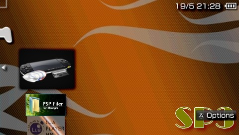

Lua System SP(3)
================

Small old homebrew Lua shell written in Lua for PSP

##What's this ?
A homebrew shell.

##Notes
Compatible with PSP Fat and Slim

##Installation Path
ms0:/PSP/GAME/

##License
* *Code* : The MIT License (MIT). Copyright (c) 2008 Roland Y. See [LICENSE](license).
* *TacticalPenguin* (for MS Explorer code)
* *MediumGauge* (for *PSPFiler*)
* *Sprites* : Copyright (c) 2008 J3r3mie
